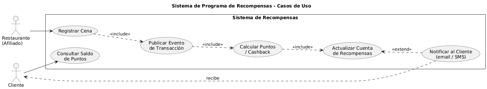

# Laboratorio 8 - Sistema de Recompensas (Arquitectura Hexagonal + EDA)

Sistema de recompensas para restaurantes implementado con **Arquitectura
Hexagonal (Ports & Adapters)** y **Event-Driven Architecture** sobre
**RabbitMQ**.

---

## 1. Problema

Cada vez que un cliente cena en un restaurante afiliado, una parte de su
consumo se convierte en puntos que se acreditan a su cuenta. El sistema debe
procesar grandes volúmenes de transacciones en tiempo real, por lo que se
desacopla mediante mensajería asíncrona.

Flujo (Figura 1 del enunciado):


## 2. Arquitectura

Se aplicó **Arquitectura Hexagonal** en los tres microservicios. Cada uno
tiene tres capas con dependencias hacia adentro:

```
infrastructure  ->  application  ->  domain
   (adapters)       (use cases)    (entities + ports)
```

- **Domain**: Entidades, *value objects*, políticas y **puertos** (interfaces
  abstractas). No depende de nada externo (ni de `pika`, ni de FastAPI).
- **Application**: Casos de uso que orquestan el dominio. Depende solo de
  puertos.
- **Infrastructure**: Adaptadores concretos (RabbitMQ, REST con FastAPI,
  persistencia en memoria). Implementan los puertos del dominio.

Esto garantiza:

| Atributo | Cómo se cumple |
|---|---|
| **Alta cohesión** | Cada módulo tiene una sola responsabilidad |
| **Bajo acoplamiento** | El dominio no conoce a RabbitMQ; los adaptadores se inyectan |
| **Modularidad** | 3 servicios independientes, cada uno desplegable por separado |
| **Escalabilidad** | Cualquier servicio se puede replicar horizontalmente |
| **Event-Driven** | Servicios se comunican solo vía eventos por el broker |

### Estructura del repositorio

```
.
├── restaurant_service/          # Productor: registra cenas vía REST y publica eventos
│   ├── domain/
│   │   ├── model/dinner.py
│   │   └── ports/dinner_publisher.py
│   ├── application/register_dinner.py
│   └── infrastructure/
│       ├── rest/api.py              (adaptador de entrada: FastAPI)
│       └── messaging/rabbit_publisher.py  (adaptador de salida: pika)
│
├── rewards_service/             # Consumidor: calcula puntos y notifica
│   ├── domain/
│   │   ├── model/{reward_account, dinner_event}.py
│   │   ├── policy/points_policy.py  (estrategia)
│   │   └── ports/{reward_repository, notification_publisher}.py
│   ├── application/process_dinner.py
│   └── infrastructure/
│       ├── messaging/rabbit_consumer.py
│       ├── messaging/rabbit_notification_publisher.py
│       └── persistence/in_memory_repo.py
│
├── notifications_service/       # Consumidor: simula envío de correo/SMS
│   ├── domain/
│   │   ├── model/notification.py
│   │   └── ports/notification_sender.py
│   ├── application/send_notification.py
│   └── infrastructure/
│       ├── messaging/rabbit_consumer.py
│       └── sender/console_sender.py
│
├── tests/                       # ≥85% cobertura
├── pytest.ini
├── requirements.txt
└── sonar-project.properties
```

### Diagrama de Casos de Uso



## 3. Mensajería

| Cola RabbitMQ | Productor | Consumidor | Payload JSON |
|---|---|---|---|
| `dinner.registered` | restaurant_service | rewards_service | `{amount, card_number, restaurant_code, occurred_at}` |
| `reward.processed` | rewards_service | notifications_service | `{card_number, points_added, total_points}` |

**Política de puntos** (`PercentagePointsPolicy`): 10 % del monto consumido por
defecto.

## 4. Cómo correr

```bash
python -m venv .venv
source .venv/bin/activate
pip install -r requirements.txt
```

### Tests

```bash
pytest
```

### Levantar los servicios (3 terminales)

```bash
# Terminal 1 — Restaurante (API REST)
python -m restaurant_service.main

# Terminal 2 — Recompensas
python -m rewards_service.main

# Terminal 3 — Notificaciones
python -m notifications_service.main
```

### Enviar una cena de prueba

```bash
curl -X POST http://localhost:8000/dinners \
  -H 'Content-Type: application/json' \
  -d '{
    "amount": "150.00",
    "card_number": "4111111111111234",
    "restaurant_code": "REST-001",
    "occurred_at": "2026-05-24T19:30:00"
  }'
```

### Análisis SonarQube

```bash
sonar-scanner
```

Lee `sonar-project.properties` y sube los resultados a
`https://sonarqube.ingsoftware.lat/`.

## 5. Justificación del broker

Se eligió **RabbitMQ** sobre Kafka/ActiveMQ porque:

1. La Figura 1 se muestra ActiveMQ (modelo AMQP); RabbitMQ usa el mismo modelo
   `Producer → Exchange → Queue → Consumer`.
2. El caso de uso es *work queue* transaccional, no streaming masivo (Kafka
   sería sobredimensionar).
3. Gracias a hexagonal, migrar a Kafka requiere reemplazar
   `rabbit_consumer.py` / `rabbit_publisher.py` — el resto del código no
   cambia.

## 6. Calidad

- **Tests**: `pytest` + `pytest-cov`, cobertura ≥ 85 %
- **Análisis estático**: SonarQube (Reliability, Security, Maintainability,
  Duplications).
- **Diseño**: Puertos abstractos (`ABC`), entidades inmutables
  (`dataclass(frozen=True)`), validación en construcción.
