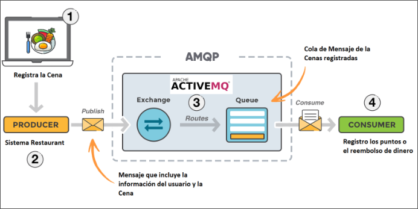
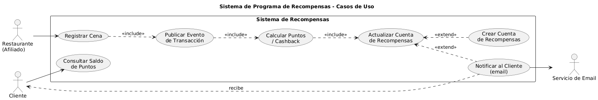
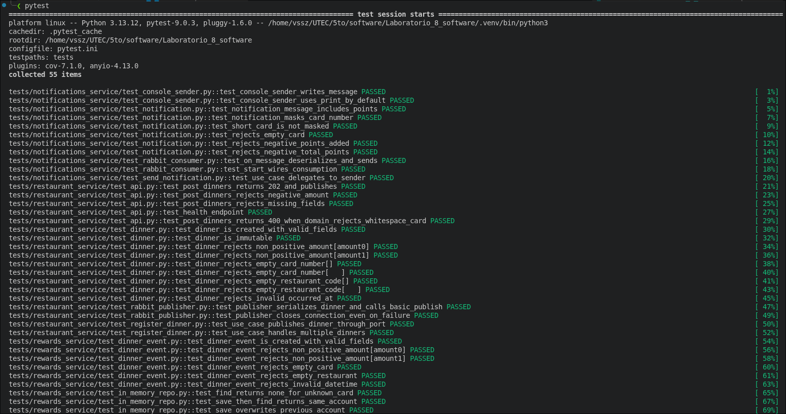
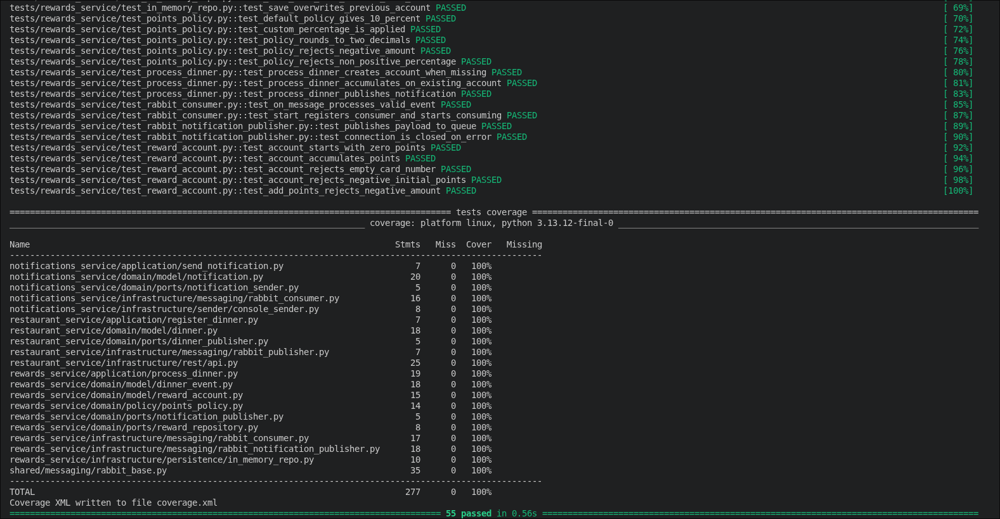
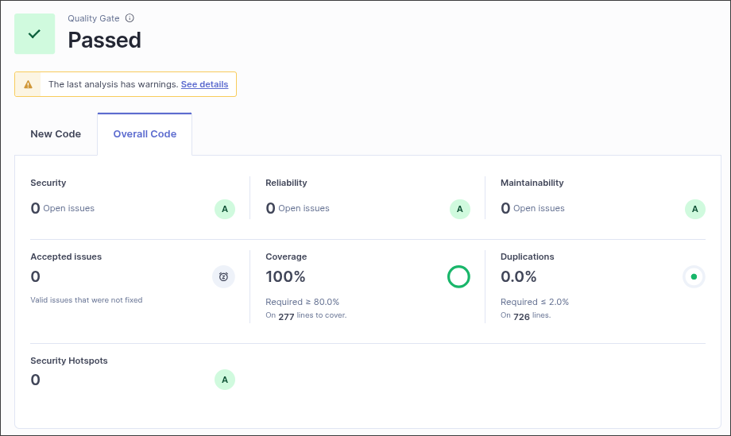

# Laboratorio 8 - Sistema de Recompensas (Arquitectura Hexagonal + EDA)

Sistema de recompensas para restaurantes implementado con **Arquitectura
Hexagonal (Ports & Adapters)** y **Event-Driven Architecture** sobre
**RabbitMQ**.

- **Repositorio:** https://github.com/EV081/Laboratorio_8_software
- **Análisis SonarQube:** https://sonarqube.ingsoftware.lat/dashboard?id=Elmer_Villegas_t1&codeScope=overall

---

## 1. Problema

Cada vez que un cliente cena en un restaurante afiliado, una parte de su
consumo se convierte en puntos que se acreditan a su cuenta. El sistema debe
procesar grandes volúmenes de transacciones en tiempo real, por lo que se
desacopla mediante mensajería asíncrona.

Flujo (Figura 1 del enunciado):



## 2. Arquitectura

La solución que se implemento fu con tres microservicios que se comunican de forma
asíncrona a través de RabbitMQ, siguiendo un estilo **Event-Driven**: el
modulo de Restaurantes recibe las cenas por una API REST y publica el evento
`dinner.registered`; el modulo de Reward lo consume para calcular los puntos
y a su vez emite `reward.processed`; y el modulo de Notificaciones reacciona a
ese último para avisarle al cliente. De esta forma cada servicio se despliega
y escala por separado, y ninguno depende directamente de los otros, solo del
broker.

Dentro de cada microservicio aplicamos el patrón **Hexagonal (Ports &
Adapters)**, que organiza el código en tres capas con dependencias hacia
adentro:

- **Domain**: Entidades, *value objects*, políticas y **puertos** (interfaces abstractas). No depende de nada externo.
- **Application**: Casos de uso que orquestan el dominio. Depende solo de
  puertos.
- **Infrastructure**: Adaptadores concretos (RabbitMQ, REST con FastAPI,
  persistencia en memoria). Implementan los puertos del dominio.

Esto garantiza:

| Atributo | Cómo se cumple |
|---|---|
| **Alta cohesión** | Cada módulo tiene una sola responsabilidad |
| **Bajo acoplamiento** | El dominio no conoce a RabbitMQ; los adaptadores se inyectan |
| **Modularidad** | 3 servicios independientes, cada uno desplegable por separado |
| **Escalabilidad** | Cualquier servicio se puede replicar horizontalmente |
| **Event-Driven** | Servicios se comunican solo vía eventos por el broker |

### Diagrama de Casos de Uso



**Explicación del diagrama**                                                                      

Identificamos tres actores. El Restaurante es el actor primario que dispara todo el flujo
cuando registra una cena; el Cliente es primario cuando consulta su saldo y aparece como      
receptor cuando le llega una notificación; y el Servicio de Email es un actor
secundario, un proveedor externo al que le delegamos el envío real del correo.                

El flujo principal arranca con Registrar Cena (UC1), que el restaurante invoca a través de la 
API REST. Este caso siempre incluye Publicar Evento de Transacción (UC2), porque el registro
no termina hasta que el evento se publica en RabbitMQ. UC2 a su vez incluye 
Calcular Puntos / Cashback (UC3), que aplica la política configurada (por defecto, 10 % del 
consumo), y este se incluye dentro de Actualizar Cuenta de Recompensas (UC4), que persiste los
puntos en la cuenta del cliente. Los tres <<include>> representan que ninguno de estos pasos
es opcional: si falla uno, el flujo no se completa.

Dos casos extienden UC4 porque solo se ejecutan bajo cierta condición. Crear Cuenta de        
Recompensas (UC7) se dispara únicamente cuando la tarjeta aparece por primera vez en el
sistema, es decir, cuando no existe una cuenta previa asociada a ese card_number. Notificar al Cliente por email (UC5) se 
modela como extensión porque, además de depender de la actualización exitosa de la cuenta,
requiere salir del sistema para llegar al proveedor externo de correo.

Por último, Consultar Saldo de Puntos (UC6) es un flujo independiente que el cliente ejerce   
por su cuenta, sin estar encadenado al registro de cenas.

El actor secundario **"Servicio de Email"** representa un proveedor externo
(ej. SendGrid, AWS SES) al que el sistema delega el envío real del correo.
La implementación actual simula este envío, pero el puerto `NotificationSender` permite sustituir el adaptador sin modificar el dominio ni la capa de aplicación, manteniendo la arquitectura hexagonal.

## 3. Mensajería

| Cola RabbitMQ | Productor | Consumidor | Payload JSON |
|---|---|---|---|
| `dinner.registered` | restaurant_service | rewards_service | `{amount, card_number, restaurant_code, occurred_at}` |
| `reward.processed` | rewards_service | notifications_service | `{card_number, points_added, total_points}` |

**Política de puntos** (`PercentagePointsPolicy`): 10 % del monto consumido por
defecto.

## 4. Cómo correr

```bash
python -m venv .venv
source .venv/bin/activate
pip install -r requirements.txt
```

### Tests

```bash
pytest
```

### Levantar los servicios (3 terminales)

```bash
# Terminal 1 — Restaurante (API REST)
python -m restaurant_service.main

# Terminal 2 — Recompensas
python -m rewards_service.main

# Terminal 3 — Notificaciones
python -m notifications_service.main
```

### Enviar una cena de prueba

```bash
curl -X POST http://localhost:8000/dinners \
  -H 'Content-Type: application/json' \
  -d '{
    "amount": "150.00",
    "card_number": "4111111111111234",
    "restaurant_code": "REST-001",
    "occurred_at": "2026-05-24T19:30:00"
  }'
```

### Análisis SonarQube

Si tienes `sonar-scanner` instalado en tu sistema:

```bash
sonar-scanner
```

## 5. Justificación del broker

Se eligió **RabbitMQ** sobre Kafka/ActiveMQ porque:

1. La Figura 1 se muestra ActiveMQ (modelo AMQP); RabbitMQ usa el mismo modelo
   `Producer → Exchange → Queue → Consumer`.
2. El caso de uso es *work queue* transaccional, no streaming masivo (Kafka
   sería sobredimensionar).
3. Gracias a hexagonal, migrar a Kafka requiere reemplazar
   `rabbit_consumer.py` / `rabbit_publisher.py` — el resto del código no
   cambia.

## 6. Calidad

- **Tests**: `pytest` + `pytest-cov`, cobertura ≥ 85 %
- **Análisis estático**: SonarQube (Reliability, Security, Maintainability,
  Duplications).
- **Diseño**: Puertos abstractos (`ABC`), entidades inmutables
  (`dataclass(frozen=True)`), validación en construcción.

## 7. Evidencia de ejecución de pruebas

Ejecución de las pruebas automatizadas con `pytest`:




Cobertura y métricas de calidad reportadas por SonarQube:

